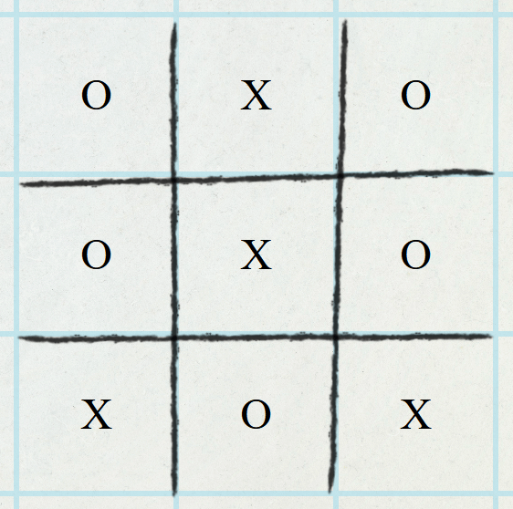
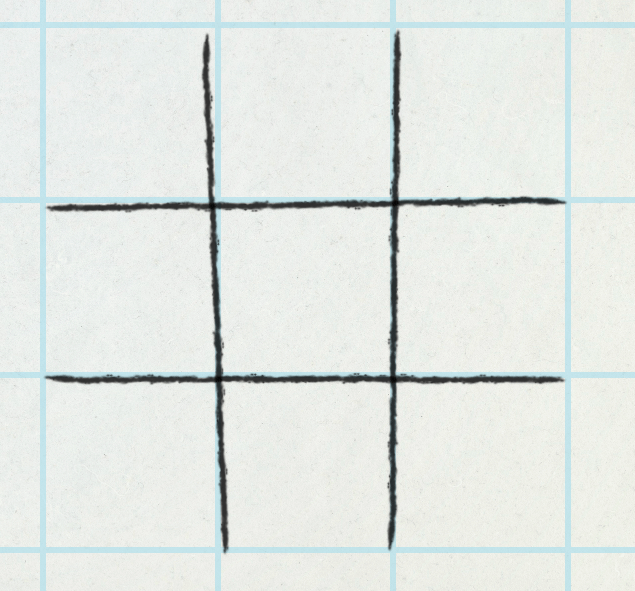
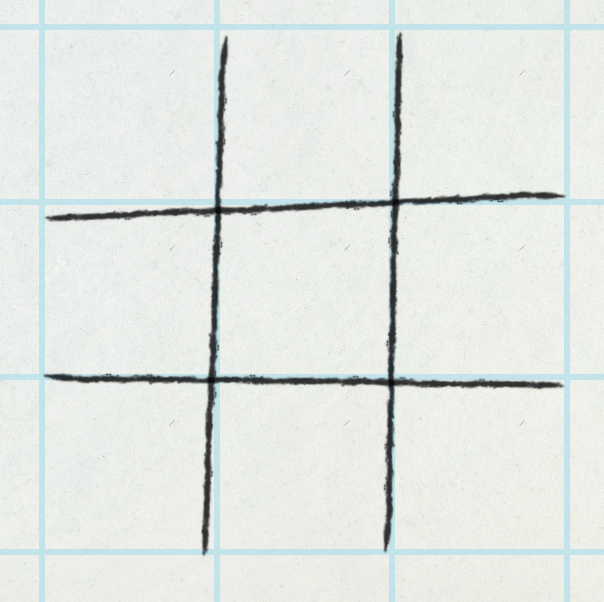
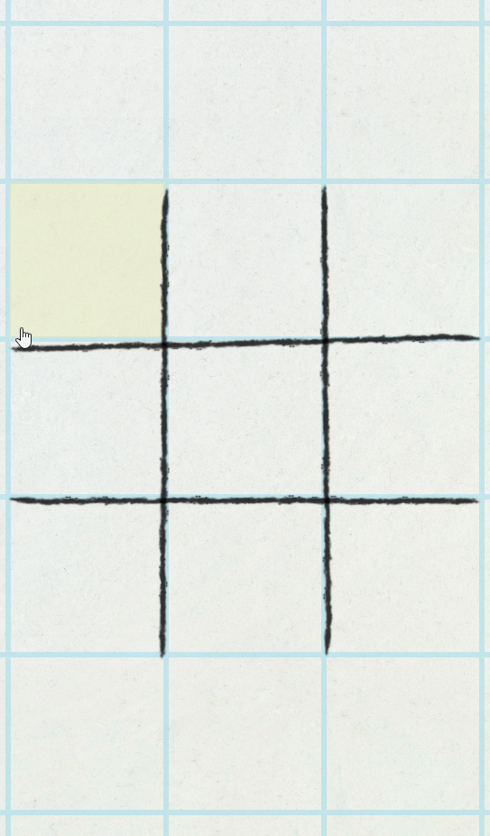
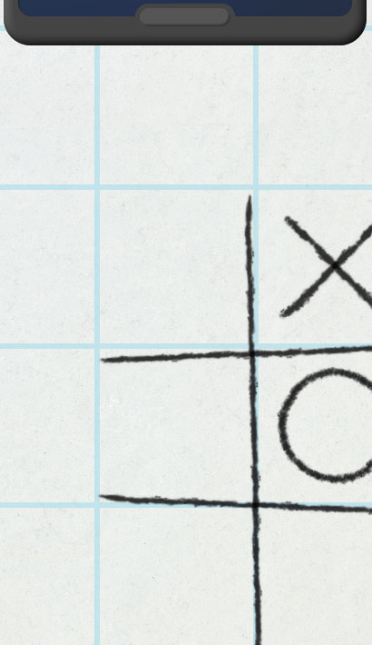
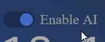
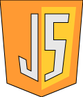

# odin-tic-tac-toe

# Live: https://hectorvilas.github.io/odin-tic-tac-toe/

Welcome to my new project! This time I'm doing another practice from The Odin Project ([This one](https://www.theodinproject.com/lessons/node-path-javascript-tic-tac-toe)), a classic Tic-Tac-Toe, involving factory functions and the module pattern.

I've been reading and watching videos about patterns and this kind of functions, other than the ones provided by Odin, and I can see the great potential and practicality of this, so I'm going to implement them in future projects. Still, this is the first time using them, other than some basic functions I wrote in the browser's console for testing, so I'm not yet sure how I'm going to approach this practice. Maybe I can come up with an idea after writing a roadmap.


## Requisites by Odin:

- ✔️store the gameboard as an array inside of a Gameboard object
- ✔️players are also going to be stored in objects
- ✔️an object to control the flow of the game itself
- ✔️have as little global code as possible
- - ✔️tuck everything away inside of a module or factory
- ✔️write a JS function that will render the contents of the gameboard array to the webpage
- ✔️functions to allow players to add marks to a specific spot on the board, and then tie it to the DOM, letting players click on the gameboard to place their marker
- ✔️build the logic that checks for when the game is over
- ✔️allow players to put in their names
- ❌include a button to start/restart the game
- ✔️add a display element that congratulates the winning player (it's on their speechs)
- ⭕optional - create an AI so that a player can play against the computer
- - ✔️get the computer to make a random legal move
- - ❓work on making the computer smart

## Roadmap

<!-- ❌ ✔️ ⭕ ❓ -->

The page:

- ✔️a way to write and edit player names (modal?)
- ✔️a play area in the center
- - ✔️made with grid
- - ~~size adjusted by viewport~~ (static values has been used for aesthetics)
- - ✔️9 `div`s autofilling the cells
- ❌a reset button

The code:

- ✔️function factory for players
- - ✔️store name
- - ✔️store cross or circle for play area
- ✔️module pattern for board
- ~~module pattern for rules (or in board too)~~ It's on gameFlow

The game:
- ~~start asking for players names (player1 and player2 at default)~~ default names by design
- ✔️draw the board, empty
- ~~at random one of the player starts~~ player 1 always starts
- ✔️player1 places ~~circles~~ crosses and player2 ~~crosses~~ circles
- ✔️each time a player places a mark, it's the other player's turn
- ✔️marks can only be placed at empty spaces
- ✔️each play, the win condition checks the board
- - ✔️3 marks of the same player must form an horizontal, vertical or diagonal line
- - ✔️if there's a line, the game ends, the player that made the line wins
- - ✔️when another game starts, first play is for the player that lost
- - ~~on a tie, the starting player is chosen at random~~ always change turns


## update 1
I had no idea where to start, so I started with the less important but fun part: the styling. After experimenting for hours, I came with a conclusion:
- 9 divs with static dimension values
- a tiled background aligned with the play area
- pencil lines drawing the lines in the play area


Now it looks like a school paper with grid pattern. With a little rotation and position adjusts, I made the lines look irregular, to give a hand-drawn feel.

### credits: 

Behind my grid image, there's a [paper texture](https://www.freepik.com/free-photo/paper-textured-background_2971954.htm), made by [rawpixel.com](https://www.freepik.com/author/rawpixel-com) on [Freepik](https://www.freepik.com/).

## update 2
I've been working again in the visual part of the game. I wanted the lines of the play area to be drawn, so I traced a hand holding a marker from one of the videos of [Jazza](https://www.youtube.com/c/Jazza)'s YouTube channel, and replaced the marker with a pencil. After some work with InkScape (adjusting, grouping, smoothing and renaming) I decided I should place the pencil tip at the 0 0 position to make things easier.

This is the result:


After some experimenting, I finally achieved what I wanted: the play area being drawn:


This was made with CSS' `@keyframes`, 5 of them, for the hand and each line. The keyframes are in sync so the lines get drawn when the pencil goes over it. I couldn't just shrink the div of each line, the pencil stroke would look like compressing, so I used `clip-path` to hide them, then animated it's coordinates to make it appear exactly where the pencil tip goes.

### thoughts
I should leave the aesthetic part for the end, but having this on screen instead of 9 squares in a plain background gives me motivation, I can keep going for hours. I saw other user's project for the tic-tac-toe practice and honestly doesn't look like they enjoyed doing it except for a very few users. I know, a frontend job won't be fun, it's a job after all, but why not have fun in the process of learning?

## update 3
After a few days of inactivity (spent time with another course, Js and Ruby basics, so I can get a certificate) I came back to this project. I wanted to give it a better feel, so my first change was make the draw animation start after pressing a button.

After this, I was thinking, what will happen each time a new match starts? It's paper and pencil, just deleting it's content will look bad.

I could make the hand grab an eraser and use `clip-path` to hide the lines as the eraser advances, but if I do this, even the hand gets cut by the clipping.

My second idea was making the page turn, so I can delete the play area while it's covered. This is the result:


I spent hours on it but I'm still not convinced of how it looks, but it will do for now.

### next steps:
Before I start coding, I need to redraw the play area each new game. It works fine in the first start, but needs more work to make it's animation repeat.

Another idea I had was making the hand follow the mouse cursor, but I'm not sure if I can do it, because the hand is a board's child. Maybe I can find a way, hiding the board's hand and showing another one with the same image, but still don't know how it would feel.

## update 4
After researching a little about CSS animations, I finally achieved what I wanted: the page flip, while covering the entire page, will remove the drawing, like taking it in the same page flipping, then redraw the play area. Now it can be done any number of times, it will even remove the drawing while being drawn.


The game is now ready to receive the code. Each play will be done "in a new page".

## update 5
Little changes has been done in the last few days, unsure how to work with the code, having that animation in the middle.

First I moved the listeners to a function that will run once the page loads, so I don't have anything declared as global. Then I created my first modular function to keep all the code for the visual part in a single place. Some things got renamed, I replaced the multiple `querySelector`s for a single `querySelectorAll` and, while still experimenting, I wrote some more code to simulate a game play. Without even noticing, the last action made the game playable.

The next step was moving everything to new functions. Another modular function has been created to manage the game flow (give points to players, check for win condition) and a factory function one to create the two players to store each name, mark and scores.

I tried to give the game a better feel adding sounds (page flip and drawing), but those only can be played from a clickable element, so I had to use some `setTimeout` to sync the drawing sounds with the pencil movements. The sounds are randomized from a list, so each page flip and line draw will sound different.

Here is a little GIF showing the game working:


### credits:

I used like 20 different sounds from different authors, here is the list for each sound and it's author profile (click to expand):

<details>
<summary><strong>[ Sound credits list ]</strong></summary>
Paper rustling and flipping:

Sound: https://freesound.org/people/gynation/sounds/82377/  
Author: https://freesound.org/people/gynation/

Sound: https://freesound.org/people/MattRuthSound/sounds/562038/  
Author: https://freesound.org/people/MattRuthSound/

Sound: https://freesound.org/people/XTYL33/sounds/68223/  
Author: https://freesound.org/people/XTYL33/

Sound: https://freesound.org/people/Juandamb/sounds/430622/  
Author: https://freesound.org/people/Juandamb/

Sound: https://freesound.org/people/Korczu/sounds/648387/  
Author: https://freesound.org/people/Korczu/

Sound: https://freesound.org/people/1bob/sounds/651514/  
Author: https://freesound.org/people/1bob/

Sound: https://freesound.org/people/krnash/sounds/389809/  
Author: https://freesound.org/people/krnash/

Sound: https://freesound.org/people/Huminaatio/sounds/159350/  
Author: https://freesound.org/people/Huminaatio/

Sound: https://freesound.org/people/MeefBeef/sounds/333256/  
Author: https://freesound.org/people/MeefBeef/

Sound: https://freesound.org/people/BenjaminNelan/sounds/353125/  
Author: https://freesound.org/people/BenjaminNelan/

Sound: https://freesound.org/people/aldenroth2/sounds/272015/  
Author: https://freesound.org/people/aldenroth2/

Sound: https://freesound.org/people/junkfood2121/sounds/248178/  
Author: https://freesound.org/people/junkfood2121/

Sound: https://freesound.org/people/vmgraw/sounds/235617/  
Author: https://freesound.org/people/vmgraw/


Pencil lines:

Sound: https://freesound.org/people/kbt3/sounds/318557/  
Author: https://freesound.org/people/kbt3/
</details>

### thoughts:
This practice is almost done. The game can be played, but still needs to be able to add player names, show scores and messages and, if I find a way to make one, a simple AI to play against. The rest is pure animations and aesthetics.

## update 6
As the game is already working and only needs a few additions to be considered finished, I kept working in the visual part of the project. Now the 4 drawn lines for each match have a small random rotation, to make it look hand drawn, with this little imperfection.

After this I worked with the Strikethrough lines. Now each time the game detects a win condition, it will draw a line over the winning position. I just separated the huge win conditions from the `if` to multiple `if`s, so I know which strikethrough animation must be played. Each strike line is already on screen, but hidden with `clip-path`. When it gets animated, it just modifies the `clip-path` with a transition in sync with the hand.

Here's a little demo of all the possible Strikethrough lines being drawn.



## update 7
Today I've been working in a little automation: there's no need to click on "play!" for each play anymore. Once somebody wins or in case of a tie, the next match will start automatically, with a little delay to appreciate the results of the match. Also the score is back in action, the winner will receive a point for each win.

Another good change was moving a long `switch-case` to a ternary operator and creating a simple function to prevent repetition.

And the last change was removing the mouse hover effect from the spaces if somebody wins or while the board is being drawn.

## update 8
Today I've been working in the symbols. I drew a short pencil line on Gimp to use two of them in the "X" drawing, I also drew a circle with pencil looking lines. I positioned the straight lines on pairs inside of each cell and hid them with `clip-path`. Each time the player one places a symbol, an animation corresponding of it's cell will play, moving the hand and making it draw an "X" in sync with the appearing lines animation.



This is a snippet from `CSS`, this is how I make the hand draw the center-right cross:
```CSS
.hand.x5{
  animation: x5 1s;
} @keyframes x5 {
  0% {left: 150%; top: 150%; }
  30% { left: 92%; top: 39%; }
  40% { left: 72%; top: 59%; }
  50% { left: 73%; top: 39%; }
  60% { left: 92%; top: 59%; }
  100% { left: 150%; top: 150%; }
}
```
Getting those left and top positions was a manual work, trial and error, so in the second or third position I questioned myself why I'm not automating this, so I came with the next idea:

```javascript
//get left and top percentages for board on click position
const board = document.querySelector(".board");
board.addEventListener("click", (e) => {
  console.log(
    Math.floor((e.clientX - board.offsetLeft) * 100 / board.clientWidth),
    Math.floor((e.clientY-board.offsetTop) * 100 / board.clientHeight)
  );
})
```

With this little `JavaScript` function each time I click on the board I get the left and top position in percentage. With this huge help I got the exact position for the pencil tip to place in the `@keyframe`.

After this I made a few changes in the code:

I replaced a lot of `.classList.remove( //...` with a simple `.className = "hand"`, now each time the hand receives a class to play some animation and finish animating, it will remove everything except for `.hand`.

Then I had to adjust some delay values to prevent player clicking on the board after winning, causing an exploit giving another point to the winner.

Another little change was adding a `gameOver` boolean, so delays won't re-enable the clicking action after a player wins.

### thoughts:
Today I've been working on this project for hours, mostly finding a way to do some stuff on Gimp and InkScape, and experimenting with the code. Tomorrow I'll try to make the hand draw the circles. My idea was the same as the "X" symbol drawing, but using `clip-path` differently, to reveal the circle from the center, and move the `transform-origin` for the hand away from it's 0 0 position, so it can rotate from the center of the circle, while the hand image rotates the same way but with negative values, giving an impression of it drawing a circle.

## update 9
Today I made lots of little changes in the code and finally added a visible second player. This is what I did:

I reduced a lot of repetition in `CSS` and `Js`. I think I can even reduce it a little more, I have to read it all again.

After experimenting a little with `clip-path`, I found a way to make a cirle appear like being drawn. I've been experimenting in [CodePen](https://codepen.io/) and making the sapes with [Clippy](https://bennettfeely.com/clippy/). After moving the code I wrote to this project, I duplicated the hand for the second player. Then I spent a few hours figuring out how to make it draw the circle, and came with a simple solution:

```CSS
.hand.player2.o5{
  animation: o5 1s;
} @keyframes o5 {
  0%, 100% {left: -50%; top: -50%; }
  30%, 72%{ left: 83%; top: 37%; } /*top center, start and end*/
  40% { left: 95%; } /*right*/
  50% { top: 61%;} /*bottom*/
  60% { left: 71%; } /*left*/
}
```

`left` and `top` are separated in different percentages of the timeline. They just move like individually in horizontal and vertical, then the combination make it look like moving in a circle. Now it can act like drawing:

I was going to use `offset-path`, but this will also rotate the hand, making things even harder. My solution is not perfect, but with the hands moving fast it's hard to notice imperfections. Still I can adjust things a little more.

I've also been working with Gimp, because the circle had bigger resolution than the rest, and the line was thin. The brush for the lines have a rectangular shape, so I've been experimenting with other brushes, because it won't rotate with the circular shape. I think the final result is pretty good.

And finally I've been adjusting the delays (I need it because the animations), making it possible to play faster. Instead of waiting for the players to move their hands after drawing, the other player can start anyways, without breaking any animation.

Here's a GIF showing a quick match (with the new circle drawing animation and image), no more long waits between turns.



### thoughts:
I think this is it, I should add the rest of the requisites for the course, like custom player names and scores on screen. To make things look better without HUD, I want to make the players talk. Instead of adding one to a number, the player may say it's score, or maybe taunt the other player, calling them by their respective names. Other animations and even dialogues may be added to make it feel more alive.

About the artificial inteligence, with very little code I can make it play as a second player, but I'm not sure if I'll be able to create it's logic.

## update 10
I noticed a lot of repetition in the `CSS`. Lots of keyframes had the same values at `0%` and `100%` (initial and ending position of the hands are the same), so instead of:

```css
@keyframes strikeh1 {
  0% {left: 150%; top: 150%; }
  25% { left: 100%; top: 14% }
  50% { left: 0%; top: 14%; }
  100% {left: 150%; top: 150%; }
}
```

I just removed the last line and made `100%` share properties with `0%`:

```css
@keyframes strikeh1 {
  0%, 100% {left: 150%; top: 150%; }
  25% { left: 100%; top: 14% }
  50% { left: 0%; top: 14%; }
}
```

I've already done this with the circles, I've done the same for starting-finishing position for the hand, also for the circle, which starts and ends in the same point (`30%, 72%`):

```css
@keyframes o0 {
  0%, 100% {left: -50%; top: -50%; }
  30%, 72%{ left: 16%; top: 4%; } /*top center, start and end*/
  40% { left: 29%; } /*right*/
  50% { top: 27%;} /*bottom*/
  60% { left: 4%; } /*left*/
}
```

I think I'm getting a good grip of `@keyframes`.

The next change was moving those starting positions to variables, because I wanted to make a little change, and it's position was repeated a lot. After this, I noticed that the hands are visible with a 30% zoom (on a 1080p screen), so I used the `vmax` unit to keep them always out of the screen. I'm not sure about the horizontal position, maybe I should leave it at `100%` and `0%` for each player's hand respectively, for ultrawide screens (update: done, also min-max hand size for different screen sizes).

I also made other little changes, like adjusting the `clip-path` for the circles so it won't show a small line at the corner of the cell and made the hand for the second player strikethrough it's own marks.

## update 11
I've been working in making the two players talk. I declared 3 arrays with different quotes: for winning, for a tie and for a regular turn. Then I've been experimenting again in [CodePen](https://codepen.io/) and came with a way to make the messages appear with a little transition, stay on screen for a second and delete itself after disappearing with another transition.


As you can see, when there's a tie or one player wins, the dialogue is different. It's not something to brag about, but at least the game feels a little more alive.

## update 12
Today I moved the card creation code for the dialogues to another function, now I can take advantage of this and create other dialogue events. I also added a few more dialogues, this time the players can mention the other player's name, also the loser will also have a dialogue.

I've also been working in the dialogues styling. Now those will appear with `rotateY()`, sliding from a border and with a pulsing background so it's easier to notice a new dialogue appeared and how long it has been there. After a second, it will delete itself.



And finally I discovered why winning using the last free space will interrupt the strikethrough animation and flip the page twice: both conditions had different times for the `setTimeout`, and each one had the same function to start a new match. The fix was very easy but finding out where to fix it wasn't. Also fixed the score, the loser was getting the point.

### thoughts:
I want to keep the natural feeling of the game, I don't want to add modals or any kind of HUD. I need to find a way to let the players put their names. Instead of showing it on screen, the characters will mention each other while talking. I may do something similar for the score, at some point the winner may say something like "3 vs 1; I'm still winning".

I'm not sure how I'll manage the restart button. Maybe some visual item on screen, an eraser, which when clicked will restart the game. I also want the players to change their names at any moment, so this will be another challenge. "Stop calling me [actual name here], I prefer..." and then let the player write another name.

## update 13
I finally decided how I should let the players change their names: there's two cell phones on screen, poking out at the top and bottom of the screen. With a hover it will appear completely on screen, and here you can see the current player name. Clicking on it (a hover will hint it) will let the player change their names. It also includes the current time just to make it more realistic, and a toast message at top representing a received message (it have a placeholder for now).



I've been adding new dialogues too, and another condition to mock the player who starts in the center.

I've also been checking the returns for the factory functions, I removed a few of them. Other little changes has been done in the code, nothing too important.

### thoughts:
This game is almost done (if we don't count the AI implementation). The only thing missing is a way to restart the game (I'll interpret this as a score reset). Maybe I'll make the kids leave (yes, they are bored kids at school), represent the time advancing like a day passed and make them come back.

About my personal additions, I want to add other events, like a dialogue when a player changes the name, maybe an insect walking on the paper, other characters talking with the players, whatever I can add. I also want to let the players receive random messages in their phones, just to make it feel more alive.

About the AI, I was thinking of adding a toggle switch on the phones, some kind of "be right back", to enable de AI on the current player.

## update 14
I've reached the 100 commits...

Today I've been working a little more with the dialogues. Now the players have random phrases to say when changing their names. If the previous name and the new name are the same, nothing will be said. The max length for the names has been limited to 20; or the messages won't fit on screen.

I've been working in the phone messages too. Every 30 seconds one of the phones will receive a random message. Nothing important, just a little detail.

I also made a few changes in the code, little fixes here and there, and finally added a thumbnail for the page, something that I always forget to do. Here is the image I used:


I should start working on the AI. I'm not sure how smart I can make it, but I'll try my best tomorrow.

## update 15
Today I fixed the delay when a match ends in a tie. The players were able to start before the board is completely drawn.

Then I worked with the AI, it's very basic:

```javascript
const aI = (() => {
  const run = () => {
    setInterval(() => {

      if(gameFlow.getCurrentPlayer() && !displayController.getAiStatus("p1") ||
        !gameFlow.getCurrentPlayer() && !displayController.getAiStatus("p2") ) return

      let freeSpaces = [];
      gameFlow.board.forEach((c, i) => {
        if(c === 0) freeSpaces.push(i);
      });
      const rand = Math.floor(Math.random()*freeSpaces.length);
      displayController.clickCell(freeSpaces[rand]);
    }, 900);
  };
  return { run };
})();
```

Once the function runs (on start), it will check for the checkboxes status on each player's phone every 900 milliseconds. If its checked, it will play for them. If it gets unchecked, the AI will stop playing for them.

Oh, I also added checkboxes on each phone. First I worked in the "AI", then added the boxes and a little condition to stop it from playing if it's not enabled. After this I styled it a bit, to make it look like a phone checkbox.



The player 2's checkbox will be activated by default. Both players can be AI enabled, if the user just wants to see them playing. The AI only looks for empty spaces first and then plays on any of them, so it's not advanced at all. I'm not sure how can I manage to make it smart. Maybe checking lots of win conditions for each free space.

## update 16
Today I managed to stop players from clicking on the board if the AI is the one playing. Then I spent some time with InkScape to draw the next items:

   

Now the phones have keychains, and those can be touched on touchscreens to reveal or hide the phones. A click won't do anything, `:hover` will still work as espected.

Now I need to come with an idea to represent a reset button and, optional, make the AI a little smart.