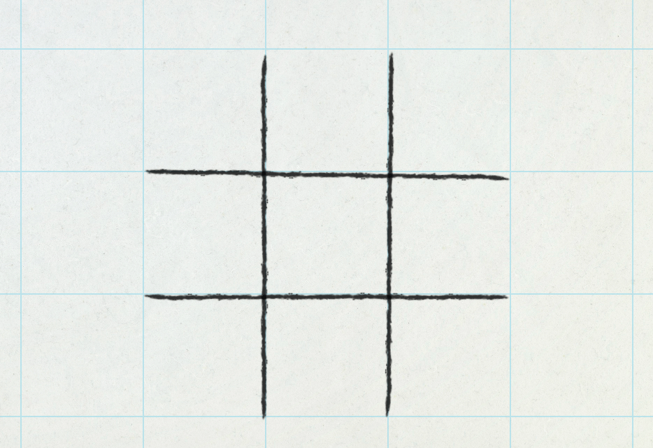
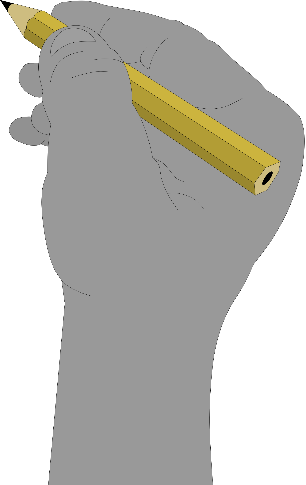
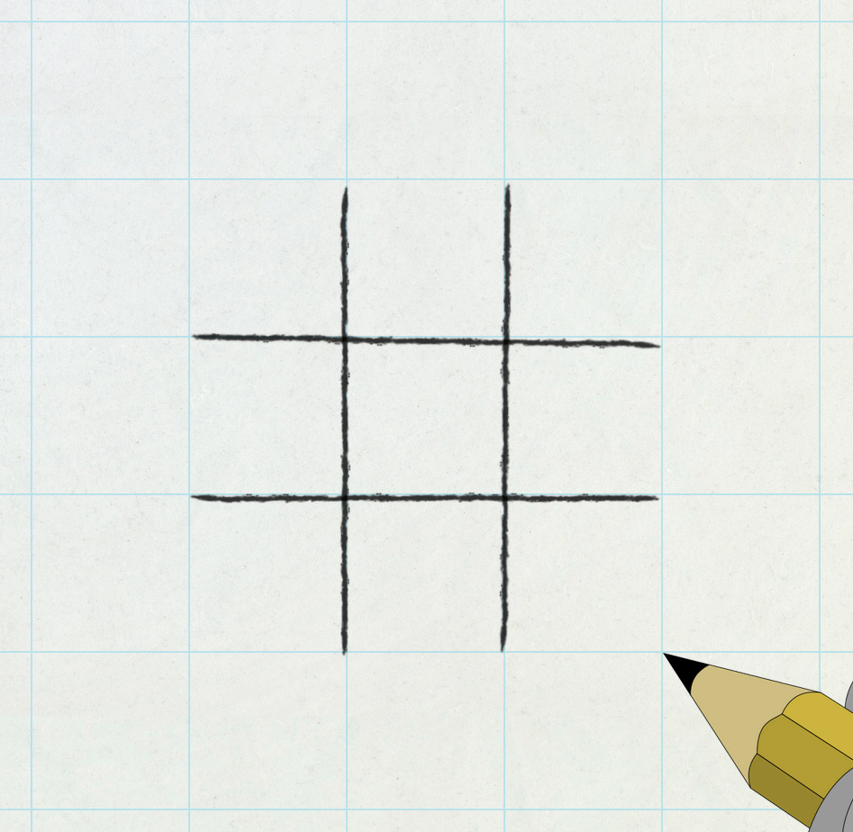

# odin-tic-tac-toe

# Live: https://hectorvilas.github.io/odin-tic-tac-toe/

Welcome to my new project! This time I'm doing another practice from The Odin Project ([This one](https://www.theodinproject.com/lessons/node-path-javascript-tic-tac-toe)), a classic Tic-Tac-Toe, involving factory functions and the module pattern.

I've been reading and watching videos about patterns and this kind of functions, other than the ones provided by Odin, and I can see the great potential and practicality of this, so I'm going to implement them in future projects. Still, this is the first time using them, other than some basic functions I wrote in the browser's console for testing, so I'm not yet sure how I'm going to approach this practice. Maybe I can come up with an idea after writing a roadmap.

## Requisites by Odin:

- ❌store the gameboard as an array inside of a Gameboard object
- ❌players are also going to be stored in objects
- ❌an object to control the flow of the game itself
- ❌have as little global code as possible
- - ❌tuck everything away inside of a module or factory
- ❌write a JS function that will render the contents of the gameboard array to the webpage
- ❌functions to allow players to add marks to a specific spot on the board, and then tie it to the DOM, letting players click on the gameboard to place their marker
- ❌build the logic that checks for when the game is over
- ❌allow players to put in their names
- ❌include a button to start/restart the game
- ❌add a display element that congratulates the winning player
- ❓optional - create an AI so that a player can play against the computer
- - ❓get the computer to make a random legal move
- - ❓work on making the computer smart

## Roadmap

<!-- ❌ ✔️ ⭕ ❓ -->

The page:

- ❌a way to write and edit player names (modal?)
- ✔️a play area in the center
- - ✔️made with grid
- - ~~size adjusted by viewport~~ (static values has been used for aesthetics)
- - ✔️9 `div`s autofilling the cells
- ❌a reset button

The code:

- ❌function factory for players
- - ❌store name
- - ❌store cross or circle for play area
- ❌module pattern for board
- ❓module pattern for rules (or in board too)

The game:
- ❌start asking for players names (player1 and player2 at default)
- ✔️draw the board, empty
- ❌at random one of the player starts
- ❌player1 places circles and player2 crosses
- ❌each time a player places a mark, it's the other player's turn
- ❌marks can only be placed at empty spaces
- ❌each play, the win condition checks the board
- - ❌3 marks of the same player must form an horizontal, vertical or diagonal line
- - ❌if there's a line, the game ends, the player that made the line wins
- - ❓when another game starts, first play is for the player that lost
- - ❓on a tie, the starting player is chosen at random

## update 1
I had no idea where to start, so I started with the less important but fun part: the styling. After experimenting for hours, I came with a conclusion:
- 9 divs with static dimension values
- a tiled background aligned with the play area
- pencil lines drawing the lines in the play area

Now it looks like a school paper with grid pattern. With a little rotation and position adjusts, I made the lines look irregular, to give a hand-drawn feel.

### credits: 

Behind my grid image, there's a [paper texture](https://www.freepik.com/free-photo/paper-textured-background_2971954.htm), made by [rawpixel.com](https://www.freepik.com/author/rawpixel-com) on [Freepik](https://www.freepik.com/).

## update 2
I've been working again in the visual part of the game. I wanted the lines of the play area to be drawn, so I traced a hand holding a marker from one of the videos of [Jazza](https://www.youtube.com/c/Jazza)'s YouTube channel, and replaced the marker with a pencil. After some work with InkScape (adjusting, grouping, smoothing and renaming) I decided I should place the pencil tip at the 0 0 position to make things easier.

This is the result:

After some experimenting, I finally achieved what I wanted: the play area being drawn:

This was made with CSS' `@keyframes`, 5 of them, for the hand and each line. The keyframes are in sync so the lines get drawn when the pencil goes over it. I couldn't just shrink the div of each line, the pencil stroke would look like compressing, so I used `clip-path` to hide them, then animated it's coordinates to make it appear exactly where the pencil tip goes.

### thoughts
I should leave the aesthetic part for the end, but having this on screen instead of 9 squares in a plain background gives me motivation, I can keep going for hours. I saw other user's project for the tic-tac-toe practice and honestly doesn't look like they enjoyed doing it except for a very few users. I know, a frontend job won't be fun, it's a job after all, but why not have fun in the process of learning?

## update 3
After a few days of inactivity (spent time with another course, Js and Ruby basics, so I can get a certificate) I came back to this project. I wanted to give it a better feel, so my first change was make the draw animation start after pressing a button.

After this, I was thinking, what will happen each time a new match starts? It's paper and pencil, just deleting it's content will look bad.

I could make the hand grab an eraser and use `clip-path` to hide the lines as the eraser advances, but if I do this, even the hand gets cut by the clipping.

My second idea was making the page turn, so I can delete the play area while it's covered. This is the result:

I spent hours on it but I'm still not convinced of how it looks, but it will do for now.

### next steps:
Before I start coding, I need to redraw the play area each new game. It works fine in the first start, but needs more work to make it's animation repeat.

Another idea I had was making the hand follow the mouse cursor, but I'm not sure if I can do it, because the hand is a board's child. Maybe I can find a way, hiding the board's hand and showing another one with the same image, but still don't know how it would feel.

## update 4
After researching a little about CSS animations, I finally achieved what I wanted: the page flip, while covering the entire page, will remove the drawing, like taking it in the same page flipping, then redraw the play area. Now it can be done any number of times, it will even remove the drawing while being drawn.

The game is now ready to receive the code. Each play will be done "in a new page".

## update 5
Little changes has been done in the last few days, unsure how to work with the code, having that animation in the middle.

First I moved the listeners to a function that will run once the page loads, so I don't have anything declared as global. Then I created my first modular function to keep all the code for the visual part in a single place. Some things got renamed, I replaced the multiple `querySelector`s for a single `querySelectorAll` and, while still experimenting, I wrote some more code to simulate a game play. Without even noticing, the last action made the game playable.

The next step was moving everything to new functions. Another modular function has been created to manage the game flow (give points to players, check for win condition) and a factory function one to create the two players to store each name, mark and scores.

I tried to give the game a better feel adding sounds (page flip and drawing), but those only can be played from a clickable element, so I had to use some `setTimeout` to sync the drawing sounds with the pencil movements. The sounds are randomized from a list, so each page flip and line draw will sound different.

Here is a little GIF showing the game working:

### credits:

I used like 20 different sounds from different authors, here is the list for each sound and it's author profile (click to expand):

<strong>[ Sound credits list ]</strong>

Paper rustling and flipping:

Sound: https://freesound.org/people/gynation/sounds/82377/  
Author: https://freesound.org/people/gynation/

Sound: https://freesound.org/people/MattRuthSound/sounds/562038/  
Author: https://freesound.org/people/MattRuthSound/

Sound: https://freesound.org/people/XTYL33/sounds/68223/  
Author: https://freesound.org/people/XTYL33/

Sound: https://freesound.org/people/Juandamb/sounds/430622/  
Author: https://freesound.org/people/Juandamb/

Sound: https://freesound.org/people/Korczu/sounds/648387/  
Author: https://freesound.org/people/Korczu/

Sound: https://freesound.org/people/1bob/sounds/651514/  
Author: https://freesound.org/people/1bob/

Sound: https://freesound.org/people/krnash/sounds/389809/  
Author: https://freesound.org/people/krnash/

Sound: https://freesound.org/people/Huminaatio/sounds/159350/  
Author: https://freesound.org/people/Huminaatio/

Sound: https://freesound.org/people/MeefBeef/sounds/333256/  
Author: https://freesound.org/people/MeefBeef/

Sound: https://freesound.org/people/BenjaminNelan/sounds/353125/  
Author: https://freesound.org/people/BenjaminNelan/

Sound: https://freesound.org/people/aldenroth2/sounds/272015/  
Author: https://freesound.org/people/aldenroth2/

Sound: https://freesound.org/people/junkfood2121/sounds/248178/  
Author: https://freesound.org/people/junkfood2121/

Sound: https://freesound.org/people/vmgraw/sounds/235617/  
Author: https://freesound.org/people/vmgraw/

Pencil lines:

Sound: https://freesound.org/people/kbt3/sounds/318557/  
Author: https://freesound.org/people/kbt3/

### thoughts:
This practice is almost done. The game can be played, but still needs to be able to add player names, show scores and messages and, if I find a way to make one, a simple AI to play against. The rest is pure animations and aesthetics.